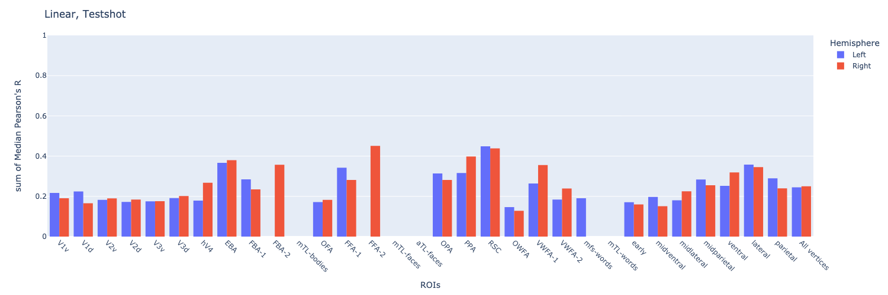
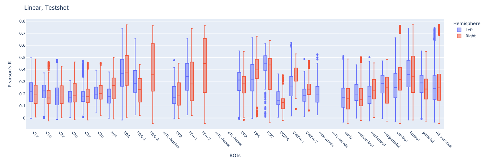

# CytoBrain

This is a repository for [Algonauts2023 competition](http://algonauts.csail.mit.edu).  
Developed by [@Cytosine](https://github.com/Catosine)

## Dataset
You may access the dataset from [here](https://naturalscenesdataset.org)

## Quick Start
```Bash
    # To start a training
    python task_train.py --data ./data --subject subj01
```

## ToDos
### 0. Preparation
- [x] [Dataset](./src/dataset.py)
- [x] [Training Script](./task_train_torch.py)
- [x] [Feature Extraction Script](./feature_extract.py)
- [x] [Inference Script](./task_inference_torch.py)

### 1. End2End Model 
- Pretrained ResNet50 + 1 FCN

### 2. CNN Extractor & Regression
- Use ResNet50 as Extractor
- Rigid/Lasso Regression
- Elastic Net (L1+L2)

## Results
| Subject | Model | Epoch | Batch | Train Loss | Train Median Pearson Coef. | Dev Loss | Dev Median Pearson Coef. | Test Median Pearson Coef. | Note |
| - | - | - | - | - | - | - | - | - | - |
| Subj01  | ResNet50 Feature + Linear Regressor | NA | NA | NA | NA | NA | NA | NA | NA |

## Figures

