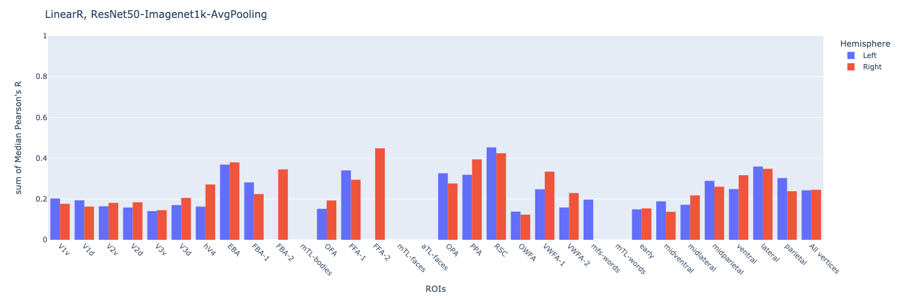
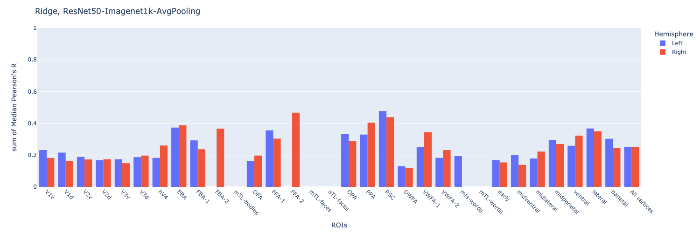
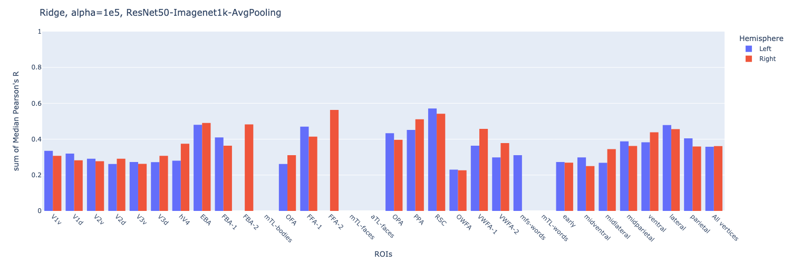

# CytoBrain

This is a repository for [Algonauts2023 competition](http://algonauts.csail.mit.edu).  
Developed by [@Cytosine](https://github.com/Catosine)

## Dataset
You may access the dataset from [here](https://naturalscenesdataset.org)

## Quick Start
```Bash
    # To start a training
    python task_train.py --data ./data --subject subj01
```

## ToDos
### 0. Preparation
- [x] [Dataset](./src/dataset.py)
- [x] [Training Script](./task_train_torch.py)
- [x] [Feature Extraction Script](./feature_extract.py)
- [x] [Inference Script](./task_inference_torch.py)

### 1. End2End Model 
- Pretrained ResNet50 + 1 FCN

### 2. CNN Extractor & Regression
- Use ResNet50 as Extractor
- Rigid/Lasso Regression
- Elastic Net (L1+L2)

## Experiment Results
### Preatrained Feature Modelling
| Subject | Feature          | Model   | Dev Median Pearons's R (Left) | Dev Median Pearons's R (Right) | Figures                                           | Note     |  
| ------  | ---------------- | ------- | ----------------------------- | ------------------------------ | ------------------------------------------------- | -------- |  
| Subj01  | resnet50-avgpool | LinearR | 0.243                         | 0.245                          | [fig](./img/linear_regression_baseline/histogram_pearson_20230308144134.png) | baseline |
| Subj01  | resnet50-avgpool | RidgeR  | 0.250                         | 0.249                          | [fig](./img/ridge_baseline/histogram_pearson_20230308144134.png) | baseline |
| Subj01  | resnet50-avgpool | RidgeR  | 0.250                         | 0.249                          | [fig](./img/ridge_baseline/histogram_pearson_20230308144134.png) | alpha=1e5 |

### Figures



