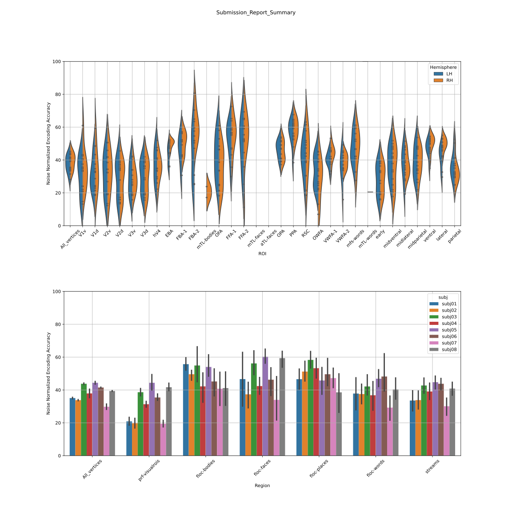

# CytoBrain

This is a repository for [Algonauts2023 competition](http://algonauts.csail.mit.edu).  
Developed by [@Cytosine](https://github.com/Catosine)

## Dataset
You may access the dataset from [here](https://naturalscenesdataset.org)

## Quick Start
### Feature Extraction
```Bash
# Extract train set features of subj01 via pretrained Resnet50
python feature_extract.py --subject subj01 --train \ 
        --save_path ~/data/subj01/training_split/test_features \
        --pretrained_weight ~/backbone/resnet50-imagenet1k-v2.pth \ 
        --layers layer3 avgpool

# Also extract test set features of subj01 via pretrained Resnet50
python feature_extract.py --subject subj01 \ 
        --save_path ~/data/subj01/training_split/test_features \
        --pretrained_weight ~/backbone/resnet50-imagenet1k-v2.pth \ 
        --layers layer3 avgpool
```
### Modelling
Please see [example notebook](example.ipynb)

## Results
### Submission
| Method | Test Median Pearson's R | Note                  | fig |  
| ------ | ----------------------- | --------------------- | --- | 
| RidgeR | 38.406                  | res50(layer3+avgpool) | [fig](./img/Submission_Report_Summary.svg) |  

### Best Submission


### Experiments: Preatrained Feature Modelling
| Subject | Feature          | Model   | Dev Median Pearson's R (Left) | Dev Median Pearson's R (Right) | Figures                                           | Note     |  
| ------  | ---------------- | ------- | ----------------------------- | ------------------------------ | ------------------------------------------------- | -------- |  
| Subj01  | resnet50-avgpool | LinearR | 0.243                         | 0.245                          | [fig](./img/resnet/linear_regression_baseline/histogram_pearson_20230308144134.png) | baseline/random crop 256 |
| Subj01  | resnet50-avgpool | RidgeR  | 0.376                         | 0.376                          | [fig](./img/resnet/ridge_resnet50_full_img_alpha_2e4/histogram_pearson_20230309171821.png) | alpha=2e4 |
| Subj01  | resnet50-layer3  | RidgeR  | 0.391                         | 0.392                          | [fig](./img/resnet/ridge_resnet50_layer3_full_img_alpha_1e3/histogram_pearson_20230314103838.png) | alpha=1e3/avgpool |
| Subj01  | resnet50-layer2  | RidgeR  | 0.328                         | 0.316                          | [fig](./img/resnet/ridge_resnet50_layer2_full_img_alpha_1e2/histogram_pearson_20230314105409.png) | alpha=1e2/avgpool |
| Subj01  | resnet50-layer1  | RidgeR  | 0.288                         | 0.282                          | [fig](./img/resnet/ridge_resnet50_layer1_full_img_alpha_1e1/histogram_pearson_20230314110252.png) | alpha=1e1/avgpool |
| Subj01  | resnet50-layer3+avgpool | RidgeR  | 0.398                         | 0.394                          | [fig](./img/resnet/ridge_resnet50_layer3%2Bavgpool_full_img_alpha_1e4/histogram_pearson_20230314144609.png) | alpha=1e4 |
| Subj01  | resnet50-layer123+avgpool | RidgeR  | 0.391                         | 0.390                          | [fig](./img/resnet/ridge_resnet50_layer1234_img_alpha_1e3/histogram_pearson_20230314152330.png) | alpha=1e3 |
| Subj01  | [vit-gpt2-image-captioning](https://huggingface.co/nlpconnect/vit-gpt2-image-captioning)-encoder-pca-128 | RidgeR  | 0.381                         | 0.380                          | [fig](./img/ridge_vit-gpt2-image-captioning_encoder_128_alpha_1/histogram_pearson_20230403175416.png) | alpha=1 |
| Subj01  | [vit-gpt2-image-captioning](https://huggingface.co/nlpconnect/vit-gpt2-image-captioning)-encoder-pca-256 | RidgeR  | 0.392                         | 0.389                          | [fig](./img/ridge_vit-gpt2-image-captioning_encoder_256_alpha_1/histogram_pearson_20230403182146.png) | alpha=1 |
| Subj01  | [vit-gpt2-image-captioning](https://huggingface.co/nlpconnect/vit-gpt2-image-captioning)-encoder-pca-512 | RidgeR  | 0.394                         | 0.393                          | [fig](./img/ridge_vit-gpt2-image-captioning_encoder_512_alpha_1/histogram_pearson_20230403181928.png) | alpha=1 |
| Subj01  | [vit-gpt2-image-captioning](https://huggingface.co/nlpconnect/vit-gpt2-image-captioning)-encoder-pca-1024 | RidgeR  | 0.387                         | 0.384                          | [fig](./img/ridge_vit-gpt2-image-captioning_encoder_1024_alpha_1/histogram_pearson_20230403181126.png) | alpha=1 |
| Subj01  | [vit-gpt2-image-captioning](https://huggingface.co/nlpconnect/vit-gpt2-image-captioning)-encoder-pca-2048 | RidgeR  | 0.350                         | 0.345                          | [fig](./img/ridge_vit-gpt2-image-captioning_encoder_alpha_1e4/histogram_pearson_20230403153120.png) | alpha=1e4 |
| Subj01  | [vit-gpt2-image-captioning](https://huggingface.co/nlpconnect/vit-gpt2-image-captioning)-encoder-avg-197 | RidgeR  | 0.143                         | 0.150                          | [fig](./img/ridge_vit-gpt2-image-captioning_encoder_197_alpha_1/histogram_pearson_20230404153025.png) | alpha=1 |
| Subj01  | [vit-gpt2-image-captioning](https://huggingface.co/nlpconnect/vit-gpt2-image-captioning)-encoder-avg-768 | RidgeR  | 0.338                         | 0.335                          | [fig](./img/ridge_vit-gpt2-image-captioning_encoder_768_alpha_1/histogram_pearson_20230404152848.png) | alpha=1 |
| Subj01  | [vit-gpt2-image-captioning](https://huggingface.co/nlpconnect/vit-gpt2-image-captioning)-encoder-avg-768 | RidgeR  | 0.378                         | 0.379                          | [fig](./img/ridge_vit-gpt2-image-captioning_encoder_768_alpha_1e4/histogram_pearson_20230404154228.png) | alpha=1e4 |
| Subj01  | [vit-gpt2-image-captioning](https://huggingface.co/nlpconnect/vit-gpt2-image-captioning)-encoder-cls | RidgeR  | 0.370                         | 0.370                          | [fig](./img/ridge_vit-gpt2-image-captioning_encoder_cls_alpha_1e4/histogram_pearson_20230404162304.png) | alpha=1e4 |

### Best Figure
