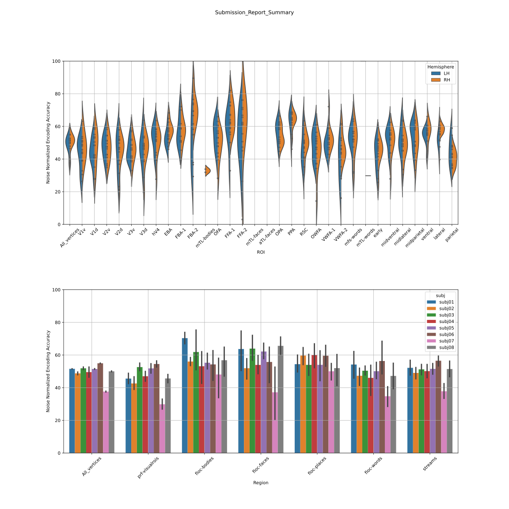

# CytoBrain

This is a repository for [Algonauts2023 competition](http://algonauts.csail.mit.edu).  
Developed by [@Cytosine](https://github.com/Catosine)

## Dataset
You may access the dataset from [here](https://naturalscenesdataset.org)

## Quick Start
### Feature Extraction
```Bash
# Extract train set features of subj01 via pretrained Resnet50
python feature_extract.py --subject subj01 --train \ 
        --save_path ~/data/subj01/training_split/test_features \
        --pretrained_weight ~/backbone/resnet50-imagenet1k-v2.pth \ 
        --layers layer3 avgpool

# Also extract test set features of subj01 via pretrained Resnet50
python feature_extract.py --subject subj01 \ 
        --save_path ~/data/subj01/training_split/test_features \
        --pretrained_weight ~/backbone/resnet50-imagenet1k-v2.pth \ 
        --layers layer3 avgpool
```
### Modelling
Please see [example notebook](example.ipynb)

## Results
### Submission
| Method | Test Median Pearson's R | Note                  |  
| ------ | ----------------------- | --------------------- |  
| RidgeR | 38.406                  | res50(layer3+avgpool) |
| RidgeR | 49.793                  | [ViT-GPT2 Image Captioning](https://huggingface.co/nlpconnect/vit-gpt2-image-captioning)(Last4Layer) |  

### Best Submission


### Experiments: Preatrained Feature Modelling
#### Resnet50
| Subject | Feature          | Model   | Dev Median Pearson's R (Left) | Dev Median Pearson's R (Right) | Figures                                           | Note     |  
| ------  | ---------------- | ------- | ----------------------------- | ------------------------------ | ------------------------------------------------- | -------- |  
| Subj01  | avgpool | LinearR | 0.243                         | 0.245                          | [fig](./img/resnet/linear_regression_baseline/histogram_pearson_20230308144134.png) | baseline/random crop 256 |
| Subj01  | avgpool | RidgeR  | 0.376                         | 0.376                          | [fig](./img/resnet/ridge_resnet50_full_img_alpha_2e4/histogram_pearson_20230309171821.png) | alpha=2e4 |
| Subj01  | layer3  | RidgeR  | 0.391                         | 0.392                          | [fig](./img/resnet/ridge_resnet50_layer3_full_img_alpha_1e3/histogram_pearson_20230314103838.png) | alpha=1e3/avgpool |
| Subj01  | layer2  | RidgeR  | 0.328                         | 0.316                          | [fig](./img/resnet/ridge_resnet50_layer2_full_img_alpha_1e2/histogram_pearson_20230314105409.png) | alpha=1e2/avgpool |
| Subj01  | layer1  | RidgeR  | 0.288                         | 0.282                          | [fig](./img/resnet/ridge_resnet50_layer1_full_img_alpha_1e1/histogram_pearson_20230314110252.png) | alpha=1e1/avgpool |
| Subj01  | layer3+avgpool | RidgeR  | 0.398                         | 0.394                          | [fig](./img/resnet/ridge_resnet50_layer3%2Bavgpool_full_img_alpha_1e4/histogram_pearson_20230314144609.png) | alpha=1e4 |
| Subj01  | layer123+avgpool | RidgeR  | 0.391                         | 0.390                          | [fig](./img/resnet/ridge_resnet50_layer1234_img_alpha_1e3/histogram_pearson_20230314152330.png) | alpha=1e3 |

#### [ViT-GPT2 Image Captioning](https://huggingface.co/nlpconnect/vit-gpt2-image-captioning)
| Subject | Feature          | Model   | Dev Median Pearson's R (Left) | Dev Median Pearson's R (Right) | Figures                                           | Note     |  
| ------  | ---------------- | ------- | ----------------------------- | ------------------------------ | ------------------------------------------------- | -------- |  
| Subj01  | encoder-pca-512 | RidgeR  | 0.394                         | 0.393                          | [fig](./img/ridge_vit-gpt2-image-captioning_encoder_512_alpha_1/histogram_pearson_20230403181928.png) | alpha=1 |
| Subj01  | encoder-pca-2048 | RidgeR  | 0.350                         | 0.345                          | [fig](./img/ridge_vit-gpt2-image-captioning_encoder_alpha_1e4/histogram_pearson_20230403153120.png) | alpha=1e4 |
| Subj01  | encoder-avg-768 | RidgeR  | 0.378                         | 0.379                          | [fig](./img/ridge_vit-gpt2-image-captioning_encoder_768_alpha_1e4/histogram_pearson_20230404154228.png) | alpha=1e4 |
| Subj01  | encoder-cls | RidgeR  | 0.370                         | 0.370                          | [fig](./img/ridge_vit-gpt2-image-captioning_encoder_cls_alpha_1e4/histogram_pearson_20230404162304.png) | alpha=1e4 |
| Subj01  | decoder-pca-512 | RidgeR  | 0.394                         | 0.386                          | [fig](./img/ridge_vit-gpt2-image-captioning_decoder_pca_512_alpha_5e3/histogram_pearson_20230407145836.png) | alpha=5e3 |
| Subj01  | decoder-pca-2048 | RidgeR  | 0.351                         | 0.345                          | [fig](./img/ridge_vit-gpt2-image-captioning_decoder_pca_2048_alpha_2e4/histogram_pearson_20230407143730.png) | alpha=2e4 |
| Subj01  | decoder-avg-768 | RidgeR  | 0.378                         | 0.379                          | [fig](./img/ridge_vit-gpt2-image-captioning_decoder_avg_768_alpha_1e4/histogram_pearson_20230407152340.png) | alpha=1e4 |
| Subj01  | decoder-cls | RidgeR  | 0.371                         | 0.370                          | [fig](./img/ridge_vit-gpt2-image-captioning_decoder_cls_alpha_1e4/histogram_pearson_20230407152957.png) | alpha=1e4 |
| Subj01  | decoder-last4-pca-512 | RidgeR  | 0.446                         | 0.442                          | [fig](./img/ridge_vit-gpt2-image-captioning_decoder_last4_pca_512_alpha_2e3/histogram_pearson_20230410133526.png) | alpha=2e3 |
| Subj01  | decoder-last1234-pca-512 | RidgeR  | 0.454                         | 0.449                          | [fig](./img/ridge_vit-gpt2-image-captioning_decoder_last1234_pca_512_alpha_5e5/histogram_pearson_20230410135111.png) | alpha=5e5 |
| Subj01  | encoder+decoder_pca_512 | RidgeR  | 0.405                         | 0.399                          | [fig](./img/ridge_vit-gpt2-image-captioning_encoder_pca_512%2Bdecoder_pca_512_alpha_1e6/histogram_pearson_20230407154405.png) | alpha=1e6 |
